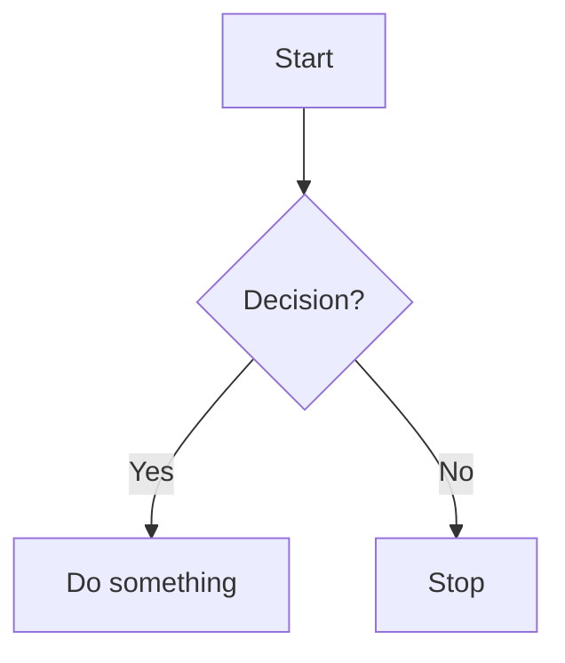

# MkDocs Embedding Showcase

This page demonstrates various content types you can embed in a MkDocs site.

---

# Youtube Videos

You can find my youtube channel  [here](https://www.youtube.com/@ArabianROSMeetup)


## 1. Images

You can embed images stored in your `docs/` folder:


---

## 2. Tables

Markdown tables are easy to create:

| Name     | Age | Country   |
|----------|-----|-----------|
| Alice    | 25  | USA       |
| Bob      | 30  | Canada    |
| Charlie  | 35  | UK        |

---

## 3. Videos

You can embed YouTube videos using raw HTML:


<iframe width="1275" height="717" src="https://www.youtube.com/embed/3gn_-80MklM" title="Mastering Motion Planning: Foundations, Algorithms, and Applications in Robotics - Part-2" frameborder="0" allow="accelerometer; autoplay; clipboard-write; encrypted-media; gyroscope; picture-in-picture; web-share" referrerpolicy="strict-origin-when-cross-origin" allowfullscreen></iframe>

---

## 4. Equations (MathJax)

Inline equation: $E = mc^2$  

Block equation:  
$$
\int_{0}^{\infty} e^{-x} \, dx = 1
$$





# MkDocs Embedding Showcase

This page demonstrates various content types you can embed in a MkDocs site.

---

# 1. Images

You can embed images stored in your `docs/` folder:


You can also set width using HTML:


You can link images:

[](https://www.google.com)

---

# 2. Tables

Markdown tables are easy to create:

| Name    | Age | Country |
| ------- | --- | ------- |
| Alice   | 25  | USA     |
| Bob     | 30  | Canada  |
| Charlie | 35  | UK      |

You can also style tables with HTML:

<table>
<tr><th>Name</th><th>Age</th><th>Country</th></tr>
<tr><td>Ali</td><td>28</td><td>Egypt</td></tr>
<tr><td>Maria</td><td>32</td><td>Spain</td></tr>
</table>

---

# 3. Videos

## Embed YouTube

<iframe width="560" height="315" src="https://www.youtube.com/embed/3gn_-80MklM" title="YouTube video player" frameborder="0" allowfullscreen></iframe>

## Local Video

<video width="320" height="240" controls>
  <source src="video/sample.mp4" type="video/mp4">
  Your browser does not support the video tag.
</video>

---

# 4. Equations (MathJax)

Inline equation: \$E = mc^2\$

Block equation:

$$
\int_{0}^{\infty} e^{-x} \, dx = 1
$$

---

# 5. Code Blocks & Syntax Highlighting

```python
# Python Example
for i in range(5):
    print(i ** 2)
```

```bash
# Bash Example
echo "Hello MkDocs!"
```

---

# 6. Diagrams with Mermaid


---

# 7. Tabs & Admonitions

\=== "Python"
`python
    print("Hello from Python tab!")
    `

\=== "Bash"
`bash
    echo "Hello from Bash tab!"
    `

!!! note
This is a note.

!!! warning
This is a warning!

---

# 8. Collapsible Sections

<details>
<summary>Click to expand</summary>

Here is some hidden text that appears when you click the arrow.

</details>

---

# 9. Buttons & Links

[Primary Button](https://www.google.com){ .md-button .md-button--primary }

[Secondary Button](https://www.youtube.com){ .md-button }

---

# 10. Embedding Google Maps

<iframe src="https://www.google.com/maps/embed?pb=!1m18!1m12!1m3!1d387190.2798944443!2d-74.25986765334678!3d40.69767006358221!2m3!1f0!2f0!3f0!3m2!1i1024!2i768!4f13.1!3m3!1m2!1s0x89c250b589c6e7bd%3A0xd89f0b1f1a663a55!2sNew%20York%2C%20USA!5e0!3m2!1sen!2seg!4v1615828575956!5m2!1sen!2seg" width="600" height="450" style="border:0;" allowfullscreen="" loading="lazy"></iframe>

---

